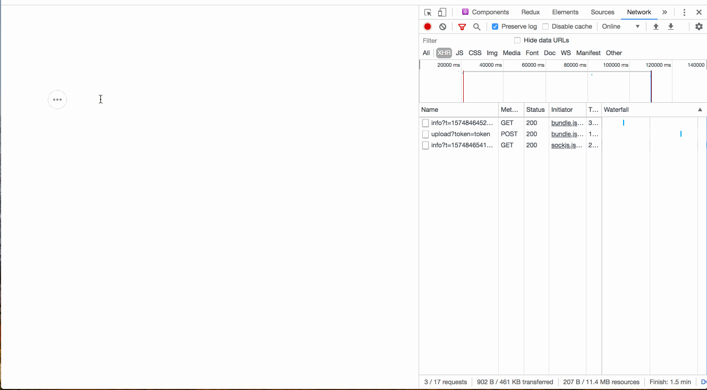

# draft-js-image-insert-demo

```sh
# 1. install and run demo page
yarn && yarn start

# 2. run file upload/donwload sever locally
docker run --rm -p 25478:25478 -v $HOME/tmp:/var/root mayth/simple-upload-server app -token f9403fc5f537b4ab332d /var/root
# > time="2019-11-26T16:25:31Z" level=info msg="starting up simple-upload-server"
# > time="2019-11-26T16:25:31Z" level=info msg="start listening" ip=0.0.0.0 port=25478 root=/var/root token=f9403fc5f537b4ab332d upload_limit=5242880

# 3. upload test
curl --form file=@`pwd`/demo1.gif 'http://localhost:25478/upload?token=f9403fc5f537b4ab332d'
# > {"ok":true,"path":"/files/demo1.gif"}

# 4. quit google chrome and re-run with cors-disabled
open http://localhost:3000/ -a "/Applications/Google Chrome.app" --args --disable-web-security --user-data-dir
```

## demo

mutiple file


resize


